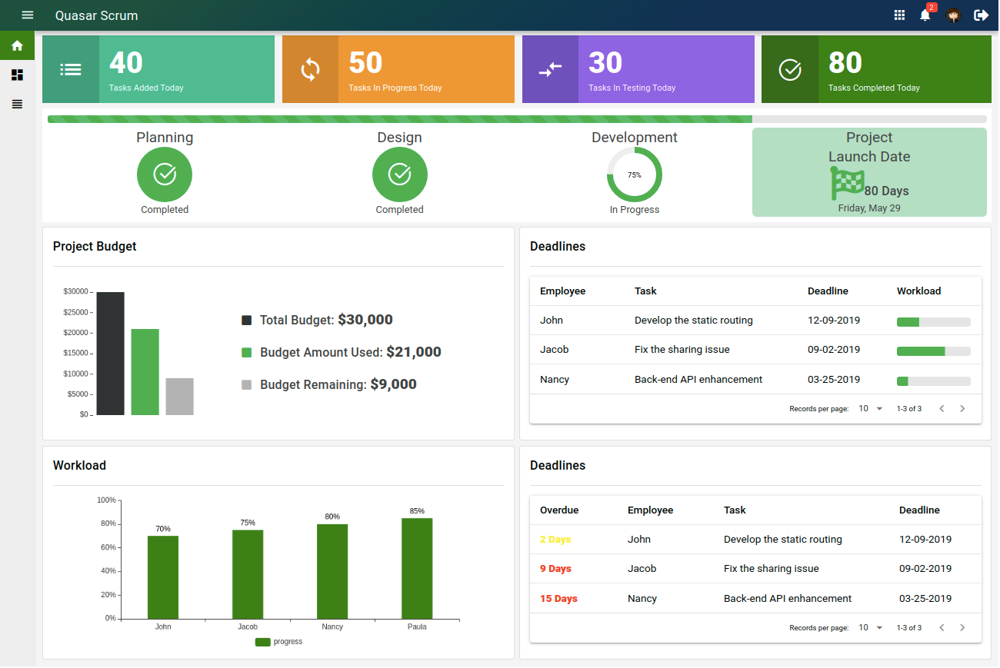
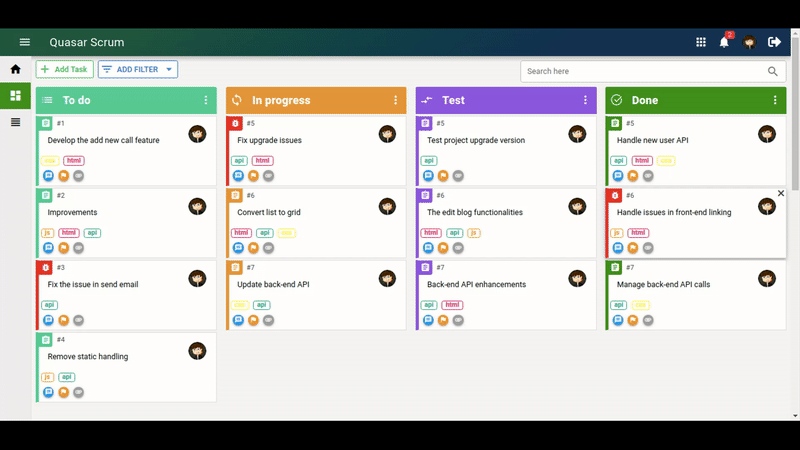
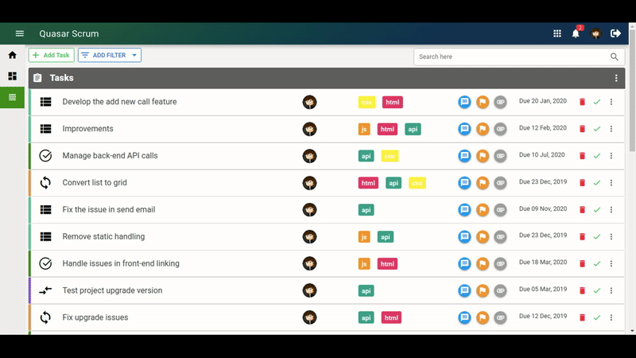
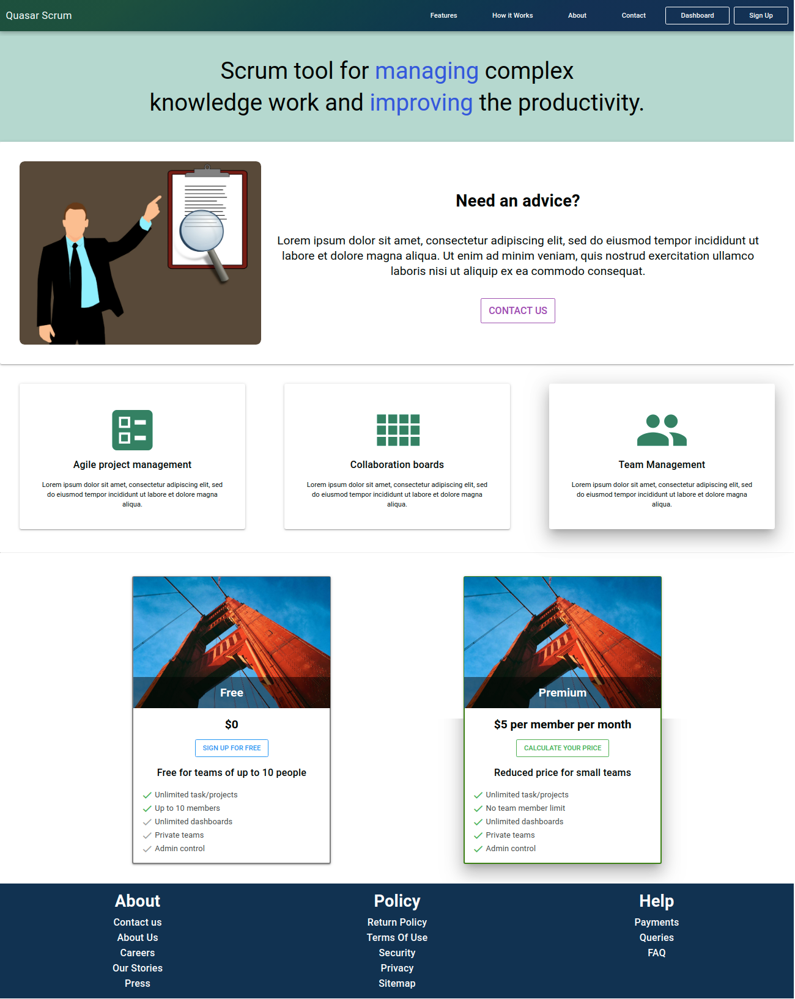

# Quasar Scrum

Quasar Scrum - Agile process framework for managing complex tasks

Few Features:
* Dashboard
* Taskboard Grid View
* Taskboard List View
* Homepage with basic details, pricing

## Site: [https://quasar-scrum.netlify.com/](https://quasar-scrum.netlify.com/)

# Support

If this helped you, you can contribute to this project by supporting me:

### [💜 Support my open-source work on GitHub](https://github.com/sponsors/mayank091193)

Please check out my sponsor page.

(GitHub currently **doubles your support**! So if you support me with $5/mo, I will get $10 instead! 😉)

Thank you very much!!

## Resources used
* [Quasar Framework](https://quasar.dev/)
* [Vue.js](https://vuejs.org/)

## Installation

* **Clone the repository**

```
git clone https://github.com/mayank091193/quasar-scrum.git
```

## Install the dependencies
```bash
cd quasar-scrum
npm install
```

### To run the app in development mode (hot-code reloading, error reporting, etc.)
```bash
quasar dev
```


### Build the application
```bash
quasar build
```

Do reach out to me at "mayank091193@gmail.com" for queries.

## Screens UI
**Dashboard Home**
<p float="left">
        <kbd>

                </kbd>
</p>

**Grid View**
<p float="left">
	<kbd>

		</kbd>
</p>

**List View**
<p float="left">
	<kbd>

	</kbd>
</p>

**Homepage**
<p float="left">
	<kbd>
	
	</kbd>
</p>

### Customize the configuration
See [Configuring quasar.conf.js](https://quasar.dev/quasar-cli/quasar-conf-js).

## License

[MIT](http://opensource.org/licenses/MIT)
